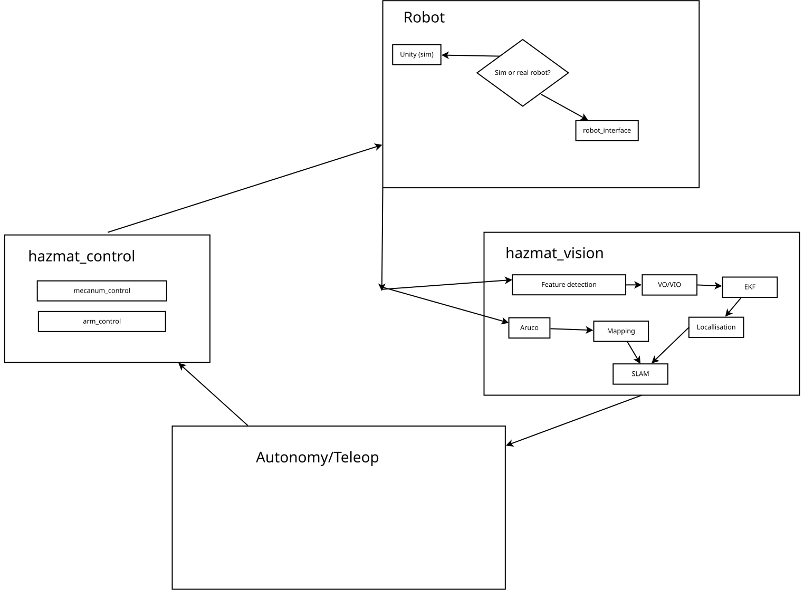

Hazmat, an indoor waste transportation and disposal robot.

## Software flowchart



## Setup

To clone the repo, ensure to also include the submodules:

```bash
# Replace the url with https version if you don't have repo access
git clone --recurse-submodules git@github.com:abdulmaajidaga/B39VS-Systems-Project.git
```

If you've already cloned the repo without the submodules, then run 

```bash
git submodule update --init
```

To build the ROS2 workspace, install the following dependencies:

- depthai
- pyserial

You can install the above on Ubuntu or related distros using:

```bash
source /opt/ros/humble/setup.bash
sudo apt install python3-serial ros-${ROS_DISTRO}-depthai ros-${ROS_DISTRO}-orocos-kdl-vendor ros-${ROS_DISTRO}-python-orocos-kdl-vendor
pip install pyserial
```

To ensure depthai drivers can access the OAK-D camera on the USB port, update your udev rules as such:

```bash
echo 'SUBSYSTEM=="usb", ATTRS{idVendor}=="03e7", MODE="0666"' | sudo tee /etc/udev/rules.d/80-movidius.rules
sudo udevadm control --reload-rules && sudo udevadm trigger
```

## Simulation

To start Unity's TCP connecter, first build and source the workspace (with submodules, see above). Then run the connector node

```bash
ros2 run ros_tcp_endpoint default_server_endpoint
```

## Controlling the robot

Start the node for serial communication for with the ESP32

```bash
ros2 run hazmat_hardware serial_bridge --ros-args -p serial_port:=/dev/ttyACM0
```

If that serial port is not available, find the correct serial port using

```bash
ls /dev/ttyACM*
```

To send wheel commands to the robot at 30Hz, use

```bash
ros2 topic pub /hazmat/wheel_cmd hazmat_msgs/msg/MecanumCmd "{rear_right: 1.0, rear_left: 1.0, front_right: 1.0, front_left: 1.0}" -r 30
```

To start the inverse kinematics solver for controlling the mobile base

```bash
ros2 run hazmat_control mecanum 
```

Then, to send linear and angular velocity commands, use

```bash
ros2 topic pub /hazmat/cmd_vel geometry_msgs/msg/Twist "{linear: {x: 1.0, y: 2.0}}" -r 30
```

Or use the teleop controller with remapped arguments

```bash
ros2 run teleop_twist_keyboard teleop_twist_keyboard --ros-args --remap cmd_vel:=/hazmat/cmd_vel
```

For package specific documentation, check each ROS package's folder.